# Bundesliga 2023/2024 SQL Analysis

This document contains the complete SQL analysis of the Bundesliga 2023/2024 season.  

All SQL screenshots are stored in `img_sql/` folder and python visualization are stored in  `graphs_python/`

---

## 1️⃣ Show All Home/Away Data
This query displays all teams' home and away performance metrics including points, wins, draws, losses, goals scored, and goal difference.

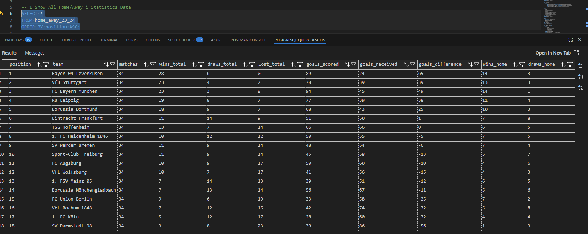

---

## 2️⃣ Show All Statistics Data
This query displays all team statistics including goals, shots, possession, passing accuracy, duels, and distance metrics.

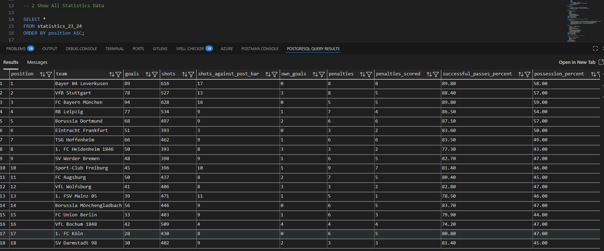

---

## 3️⃣ Goal Efficiency: Shots vs Goals & Correlation
Calculates average shots per goal for each team and shows correlation between goals, shots, and league position.

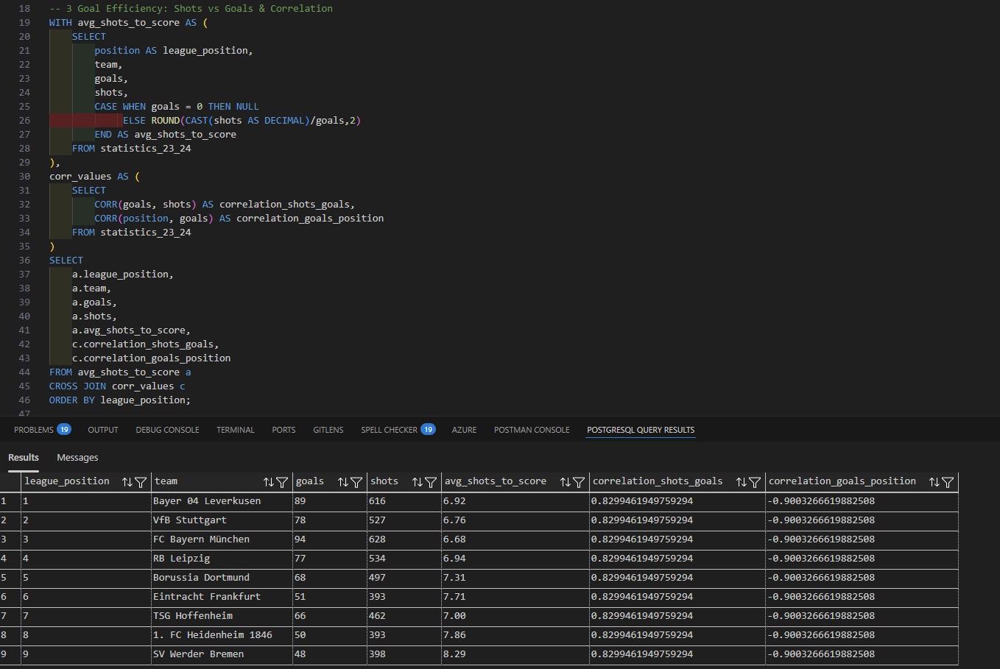

**Analysis:** 
Shots and goals show a strong positive correlation, indicating that higher shot volume generally leads to more goals.
The strong negative correlation between goals and league position reflects that teams scoring more goals tend to finish higher in the standings, as better positions are represented by lower numerical values.

---

## 4️⃣ Possession vs Successful Passes & Goals Correlation
Analyzes the relationship between possession, passing accuracy, goals scored, and league position.

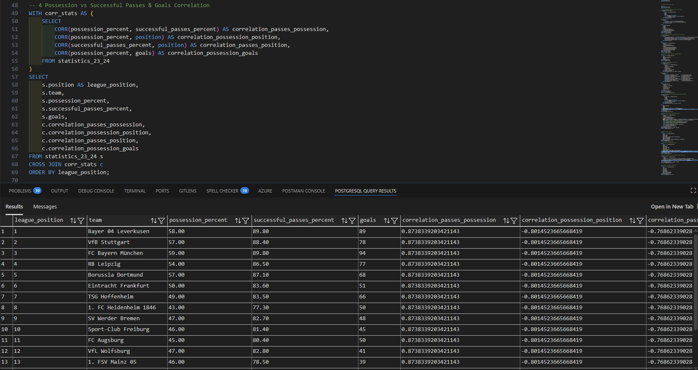

**Analysis:** 
League-level correlations show that higher possession and passing accuracy are strongly associated with more goals and better league positions (lower rank values). This confirms that ball control and technical dominance are key drivers of success across the Bundesliga season.

---

## 5️⃣ Distance Covered, Sprints & Intensive Runs
Shows physical performance metrics: total distance, sprints, and intensive runs per team.

  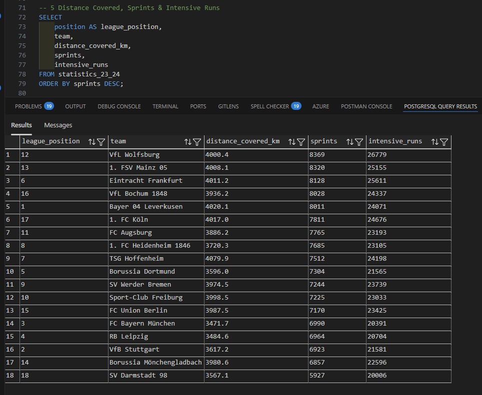
  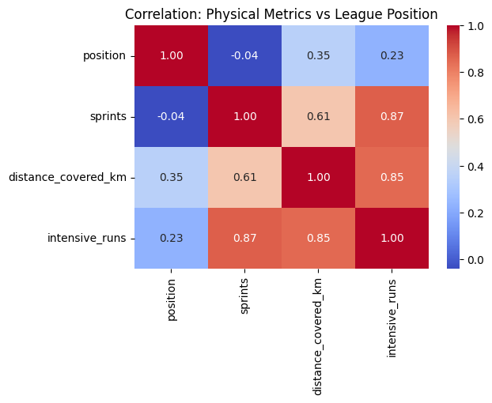

**Analysis:**
Physical metrics are strongly correlated with each other (distance, sprints, intensive runs), indicating similar work-rate profiles across teams. However, their weak correlation with league position suggests that physical output alone does not directly translate into better standings without technical and tactical efficiency.

---

## 6️⃣ Work Rate & Wins/Goals Correlation
Correlation analysis between work rate metrics (distance, sprints, intensive runs) and wins/goals.

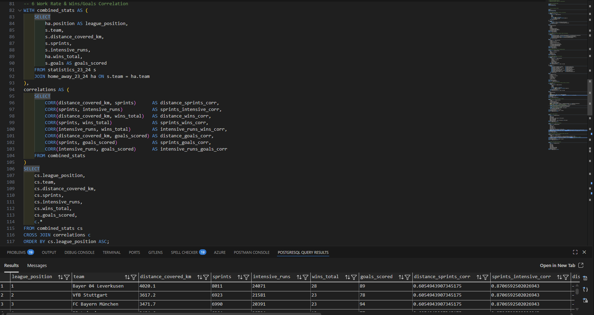

*Analysis:*  

---

## 7️⃣ Top Teams by Goal Efficiency (Shots per Goal & Z-Score)
Highlights top performers in terms of shots per goal and computes Z-score for goals.

.png)

**Analysis:**
This analysis compares teams’ goal efficiency using shots per goal and goal Z-scores relative to the league average. Teams with lower shots per goal and high positive Z-scores are the most efficient finishers, converting chances significantly better than the league norm.

---

## 8️⃣ Possession & Passes Efficiency vs Goals
Calculates passes per possession and goals per possession along with correlations.

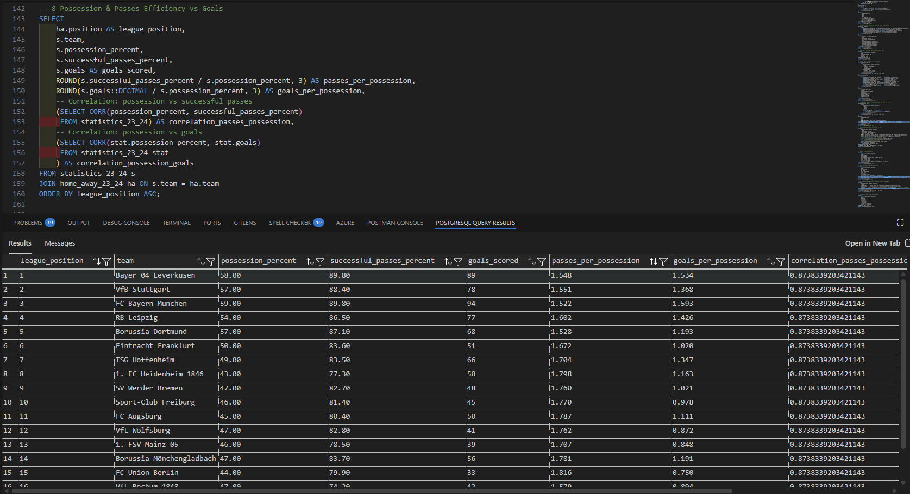

**Analysis:**
As expected, Bundesliga teams with higher possession and passing accuracy score more goals, showing a strong correlation between possession, passes, and offensive success

---

## 9️⃣ Home vs Away Analysis
Compares home vs away points and goal differences for each team.

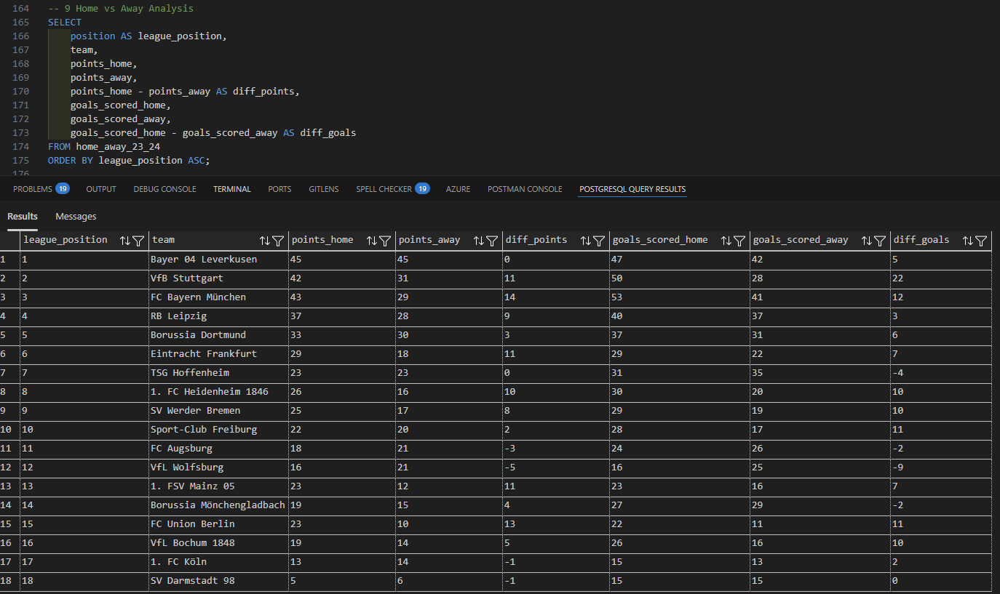

*Analysis:*  

---

## 1️⃣0️⃣ Discipline / Aggression Analysis
Shows cards, fouls, duels won, and calculates Z-scores for yellow cards and duels.

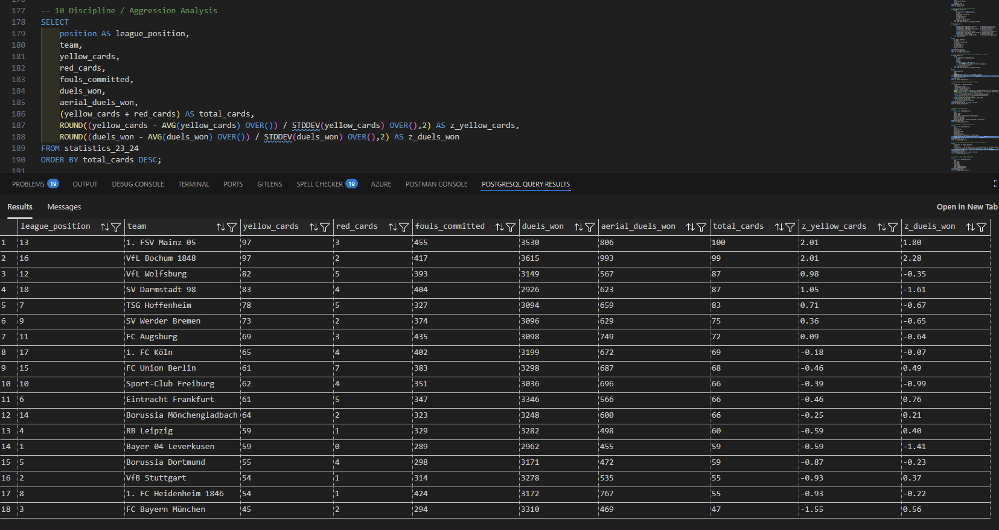

**Analysis:**
Here 

---

## 1️⃣1️⃣ Team Strength Profiling: Defense, Attack, Work Rate
Combines defensive, attacking, and work rate metrics into indexes for each team.

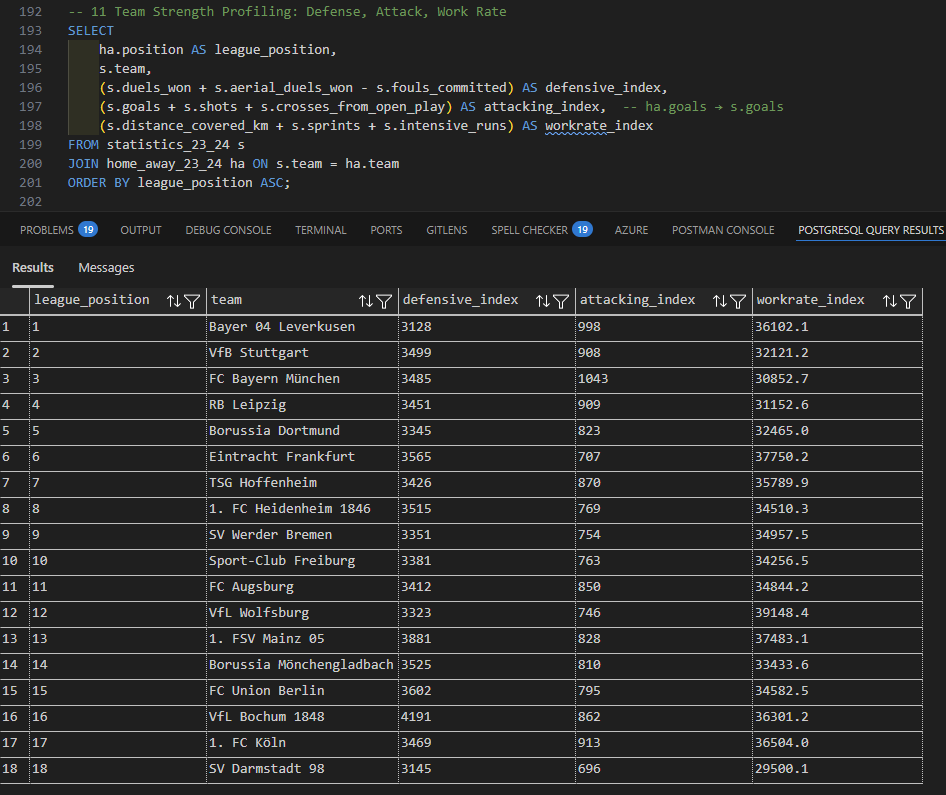

**Analysis:** 

---

## 1️⃣2️⃣ Home vs Away Games Consistency
Examines wins, draws, and goal difference home vs away for consistency analysis.

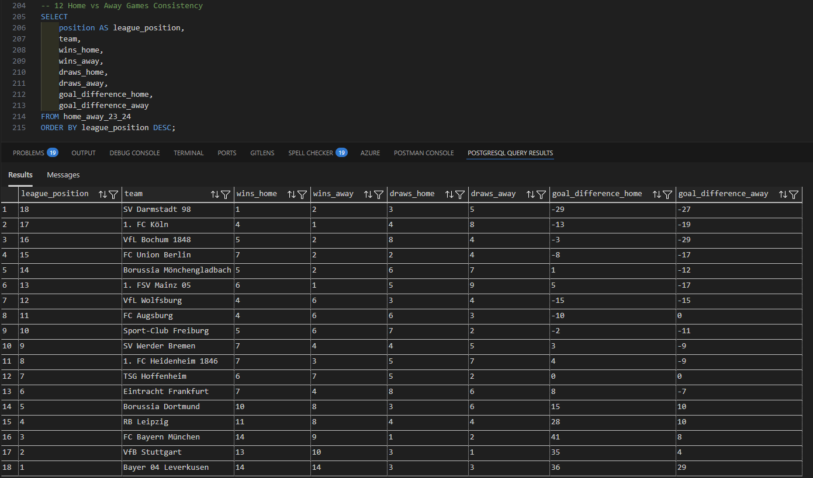

*Analysis:* 

---

## 1️⃣3️⃣ Physical Team-Level Analysis: Bayer Leverkusen vs Rest of League

Here is compared physical metrics, Leverkusen vs rest od the league.

**Analysis:** 
Leverkusen performs above the league average in all key physical metrics — covering more distance, doing more sprints and intensive runs — while also exceeding average possession (58% vs 48.8%) and passing accuracy (89.8% vs 82.5%), showing both strong work rate and technical control compared to other teams.

---
## 1️⃣4️⃣ Season Performance Analysis: Bayer Leverkusen vs Rest of League

Here are compared Leverkusen’s key season metrics to the league average.  

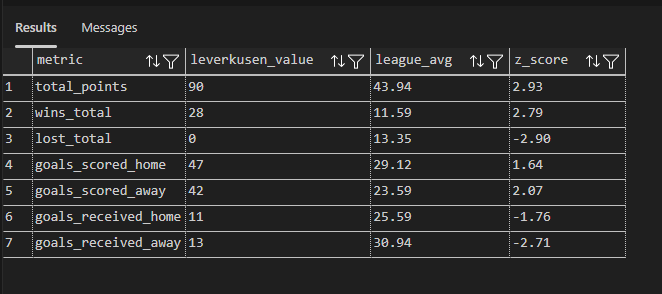

**Analysis:**  
Leverkusen massively outperforms the league in overall points and wins, with zero losses. They score significantly more goals both at home and away, while conceding far fewer than the average team, showing dominance in all aspects of performance throughout the season.

---
## 1️⃣5️⃣ Correlation & Efficiency Analysis: League vs Bayer Leverkusen

This table shows key correlations across the league and Leverkusen’s performance compared to league averages.  

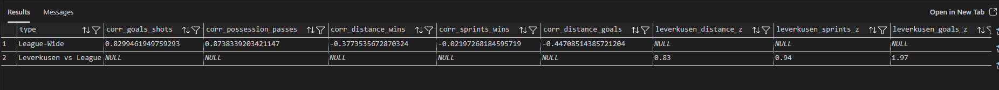

**Analysis:**  
Leverkusen exceeds the league averages across all key efficiency metrics. Their high Z-scores in distance covered, sprints, goals, possession, and passing accuracy show they combine physical effort with technical and offensive efficiency, standing out clearly compared to other teams.

---

### Notes
- All screenshots are in `img_sql/` folder.  
- All Python graphs are in `graphs_python` folder.

 
---

